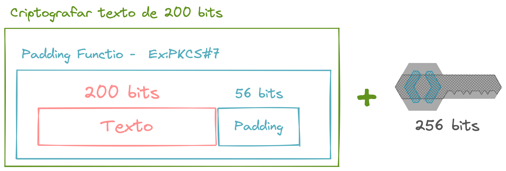

AES - Advanced Encryption Standard

- Chaves de 128, 192 ou 256 bits
- IV e Key tem que ter o mesmo tamanho
- IV Vetor de inicialização
- Usado para fazer o XOR do primeiro bloco com alguma coisa
- Nunca deve ser reaproveitado para não abrir brechas de segurança
- Não precisa guardar com igual guardamos as senhas
- NUNCA usar ECB, usar sempre CBC
- GCM é o padrão mais top que tem, ele valida a integridade do dado criptografado

---

### Padding

Por padrão os algoritmos de criptografia precisam ter as mensagens tenham valores múltiplos das chaves(128, 192, 256...), mas não é sempre que isso funciona, para preencher foi criado esse tal de Padding. Alguns padrões de Padding como o PKCS#7 ajudam a preencher essa mensagem de forma segura.

Na prática a gente adiciona o padding na mensagem antes de criptografar, e remove o padding de pois de Descriptografar para ter a mensagem original.

